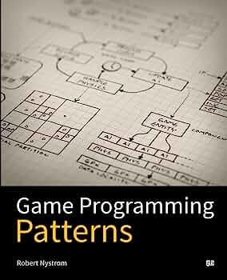

---
title: Course Book
layout: default
filename: 02_book
--- 

<h1>{{ page.title }}</h1>

There are several books these classes are taken from. All these books are freely available at the following links:
<!-- under a Creative Commons license at his website -->
<ul>
   <li><a href="https://greenteapress.com/wp/think-python-2e/">Think Python, 2nd Edition</a></li>
   <li><a href="https://www.manning.com/books/grokking-algorithms">Grokking Algorithms  
An illustrated guide for programmers and other curious people</a></li>
   <li><a href="https://inventwithpython.com/invent4thed/">Invent Your Own Computer Games with Python, 4th Edition
</a></li>
   <li><a href="https://gameprogrammingpatterns.com/contents.html">Game Programming Patterns</a></li>
</ul>

Below, a detailed description of our best picks!

<table>
   <colgroup>
      <col width="65%"/>
      <col width="35%"/>
   </colgroup>
   <tr>
      <td>
         

            <h2>... simply, Think Python!</h2>
            
We will follow this book closely, the slides are only a guide.

            
<strong>Why this book?</strong>

            
According to the Author's Preface, this book:

            <ul>
               <li>keeps it short, better to read 10 pages than 50</li>
               <li>is careful with vocabulary, minimazing jargon</li>
               <li>builds gradually, avoids trapdoors effect</li>
               <li>focus on programming (not only the language's syntax)</li>
            </ul>
         

      </td>
      <td>
         

      </td>
   </tr>
</table>
<table>
   <colgroup>
      <col width="35%"/>
      <col width="65%"/>
   </colgroup>
   <tr>
      <td>
         

      </td>
      <td>
         

            <h2>Grokking Algorithms: An illustrated guide ...</h2>
            
To illustrate some of the most advanced algorithms.

            
<strong>Why this book?</strong>

            
From the Author's own words:

            <ul>
               <li>lead with examples</li>
               <li>made easy to visualize these concepts</li>
               <li>no need to cover every sorting algorithm</li>
               <li>useful algorithms for a software engineer</li>
            </ul>
            <em>"I’m a visual learner. This book is chock-full of images."</em>
         

      </td>
   </tr>
</table>
<table>
   <colgroup>
      <col width="65%"/>
      <col width="35%"/>
   </colgroup>
   <tr>
      <td>
         

            <h2>Invent Your Own Computer Games!</h2>
            
This introduces the basics of pygame and game design.

            
<strong>Why this book?</strong>

            
When the Author was a kid:

            <ul>
               <li>he didn’t just want to play video games, but to make them</li>
               <li>he learned how to program by making video games</li>
               <li>games don’t have to be complicated to be fun!</li>
               <li>think logically (make plans) and do reconsider any idea</li>
            </ul>
         

      </td>
      <td>
         

      </td>
   </tr>
</table>
<table>
   <colgroup>
      <col width="35%"/>
      <col width="65%"/>
   </colgroup>
   <tr>
      <td>
         

      </td>
      <td>
         

            <h2>Game Programming Patterns</h2>
            
To help, with a collection of design patterns found in video games.

            
<strong>Why this book?</strong>

            
What the Author's says:

            <ul>
               <li>make the code hang together into a cohesive whole</li>
               <li>don't find it harder to make changes as the codebase grows</li>
               <li>don't feel like everything is intertwined with everything else</li>
               <li>run faster, with “cache coherency” and “object pools”</li>
            </ul>
            <em>"This is the book I wish I had when I started making games, and now I want you to have it."</em>
         

      </td>
   </tr>
</table>