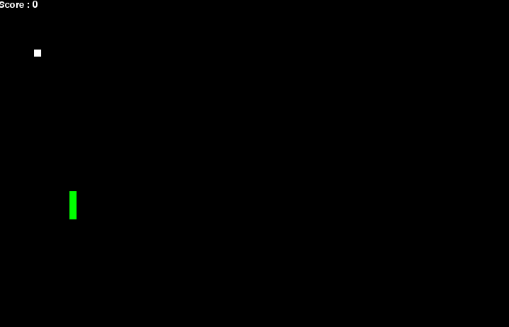

---
title: Projects
layout: default
filename: 04_projects
--- 

<h1>{{ page.title }}</h1>

Click on the animations here below, for a live demo of every project (eventually a video game) developed throughout these classes.

# Lab Sessions

<table>
   <colgroup>
      <col width="50%"/>
      <col width="50%"/>
   </colgroup>
   <tr>
      <td>
         

            <h2>Snake</h2>
            
This never-ending game will guide the students through the use of most <code>python</code> constructs, learn the basics, getting ready for the next challenge.

            <!-- 
<strong>What to do?</strong>
 -->
            
Go to the <a href="https://github.com/tur-learning/CIS1051-python/tree/lab-sessions/lab-sessions/snake/challenge">lab-sessions/snake/challenge</a> directory:

            <ul>
               <li>navigate through the different lab-sessions</li>
               <li>simply don't stop: level scaling!</li>
               <li>... keep going and look at the <code>README.md</code></li>
            </ul>
         

      </td>
      <td>
         

      </td>
   </tr>
</table>